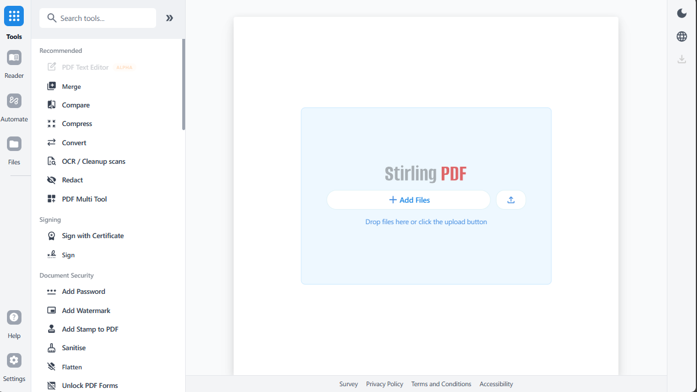

<p align="center">
  
</p>

<h1 align="center">Stirling PDF - The Open-Source PDF Platform</h1>

Stirling PDF is a powerful, open-source PDF editing platform. Run it as a personal desktop app, in the browser, or deploy it on your own servers with a private API. Edit, sign, redact, convert, and automate PDFs without sending documents to external services.

<p align="center">
  <a href="https://hub.docker.com/r/stirlingtools/stirling-pdf">
    
  </a>
  <a href="https://discord.gg/HYmhKj45pU">
    
  </a>
  <a href="https://scorecard.dev/viewer/?uri=github.com/Stirling-Tools/Stirling-PDF">
    
  </a>
  <a href="https://github.com/Stirling-Tools/stirling-pdf">
    
  </a>
</p>



## Key Capabilities

- **Everywhere you work** - Desktop client, browser UI, and self-hosted server with a private API.
- **50+ PDF tools** - Edit, merge, split, sign, redact, convert, OCR, compress, and more.
- **Automation & workflows** - No-code pipelines direct in UI with APIs to process millions of PDFs.
- **Enterprise‑grade** - SSO, auditing, and flexible on‑prem deployments.
- **Developer platform** - REST APIs available for nearly all tools to integrate into your existing systems.
- **Global UI** - Interface available in 40+ languages.

For a full feature list, see the docs: **https://docs.stirlingpdf.com**

## Quick Start

```bash
docker run -p 8080:8080 docker.stirlingpdf.com/stirlingtools/stirling-pdf
```

Then open: http://localhost:8080

For full installation options (including desktop and Kubernetes), see our [Documentation Guide](https://docs.stirlingpdf.com/#documentation-guide).

#### Convert to PDF
- **Image to PDF**: Convert images to PDF format
- **Convert file to PDF**: Convert various common file types to PDF
- **HTML to PDF**: Transform HTML documents to PDF
- **Markdown to PDF**: Convert Markdown files to PDF
- **CBZ to PDF**: Convert comic book archives
- **CBR to PDF**: Convert comic book rar archives
- **Email to PDF**: Convert email files to PDF
- **Vector Image to PDF**: Convert vector images (PS, EPS, EPSF) to PDF format

#### Convert from PDF
- **PDF to Word**: Convert to documet (docx, doc, odt) format
- **PDF to Image**: Extract PDF pages as images
- **PDF to RTF (Text)**: Convert to Rich Text Format
- **PDF to Presentation**: Convert to presentation (pptx, ppt, odp) format
- **PDF to CSV**: Extract tables to CSV
- **PDF to XML**: Convert to XML format
- **PDF to HTML**: Transform to HTML
- **PDF to PDF/A**: Convert to archival (PDF/A-1b, PDF/A-2b) format
- **PDF to Markdown**: Convert PDF to Markdown
- **PDF to CBZ**: Convert to comic book archive
- **PDF to CBR**: Convert to comic book rar archive
- **PDF to Vector Image**: Convert PDF to vector image (EPS, PS, PCL, XPS) format

## Resources

- [**Documentation**](https://docs.stirlingpdf.com)
- [**Homepage**](https://stirling.com)
- [**API Docs**](https://registry.scalar.com/@stirlingpdf/apis/stirling-pdf-processing-api/)
- [**Server Plan & Enterprise**](https://docs.stirlingpdf.com/Paid-Offerings)

## Support

- **Community** [Discord](https://discord.gg/HYmhKj45pU)
- **Bug Reports**: [Github issues](https://github.com/Stirling-Tools/Stirling-PDF/issues)

## Contributing

We welcome contributions! Please see [CONTRIBUTING.md](CONTRIBUTING.md) for guidelines.

This project uses [Task](https://taskfile.dev/) as a unified command runner for all build, dev, and test commands. Run `task dev` to get started running the editor, run `task` to see the most common commands, or see the [Developer Guide](DeveloperGuide.md) for full details.

For adding translations, see the [Translation Guide](devGuide/HowToAddNewLanguage.md).

## License

## License

Stirling PDF is open-core. See [LICENSE](LICENSE) for details.

## Supported Languages

Stirling-PDF currently supports 40 languages!

| Language                                     | Progress                               |
|----------------------------------------------|----------------------------------------|
| Arabic (العربية) (ar_AR)                     |    |
| Azerbaijani (Azərbaycan Dili) (az_AZ)        |    |
| Basque (Euskara) (eu_ES)                     |    |
| Bulgarian (Български) (bg_BG)                |    |
| Catalan (Català) (ca_CA)                     |    |
| Croatian (Hrvatski) (hr_HR)                  |    |
| Czech (Česky) (cs_CZ)                        |    |
| Danish (Dansk) (da_DK)                       |    |
| Dutch (Nederlands) (nl_NL)                   |    |
| English (English) (en_GB)                    |  |
| English (US) (en_US)                         |  |
| French (Français) (fr_FR)                    |    |
| German (Deutsch) (de_DE)                     |    |
| Greek (Ελληνικά) (el_GR)                     |    |
| Hindi (हिंदी) (hi_IN)                        |    |
| Hungarian (Magyar) (hu_HU)                   |    |
| Indonesian (Bahasa Indonesia) (id_ID)        |    |
| Irish (Gaeilge) (ga_IE)                      |    |
| Italian (Italiano) (it_IT)                   |    |
| Japanese (日本語) (ja_JP)                       |    |
| Korean (한국어) (ko_KR)                         |    |
| Norwegian (Norsk) (no_NB)                    |    |
| Persian (فارسی) (fa_IR)                      |    |
| Polish (Polski) (pl_PL)                      |    |
| Portuguese (Português) (pt_PT)               |    |
| Portuguese Brazilian (Português) (pt_BR)     |    |
| Romanian (Română) (ro_RO)                    |    |
| Russian (Русский) (ru_RU)                    |    |
| Serbian Latin alphabet (Srpski) (sr_LATN_RS) |    |
| Simplified Chinese (简体中文) (zh_CN)            |    |
| Slovakian (Slovensky) (sk_SK)                |    |
| Slovenian (Slovenščina) (sl_SI)              |    |
| Spanish (Español) (es_ES)                    |    |
| Swedish (Svenska) (sv_SE)                    |    |
| Thai (ไทย) (th_TH)                           |    |
| Tibetan (བོད་ཡིག་) (bo_CN)                   |    |
| Traditional Chinese (繁體中文) (zh_TW)           |    |
| Turkish (Türkçe) (tr_TR)                     |    |
| Ukrainian (Українська) (uk_UA)               |    |
| Vietnamese (Tiếng Việt) (vi_VN)              |    |
| Malayalam (മലയാളം) (ml_IN)                   |    |

## Stirling PDF Enterprise

Stirling PDF offers an Enterprise edition of its software. This is the same great software but with added features, support and comforts.
Check out our [Enterprise docs](https://docs.stirlingpdf.com/Pro)


## 🤝 Looking to contribute?

Join our community:
- [Contribution Guidelines](CONTRIBUTING.md)
- [Translation Guide (How to add custom languages)](devGuide/HowToAddNewLanguage.md)
- [Developer Guide](devGuide/DeveloperGuide.md)
- [Issue Tracker](https://github.com/Stirling-Tools/Stirling-PDF/issues)
- [Discord Community](https://discord.gg/HYmhKj45pU)
